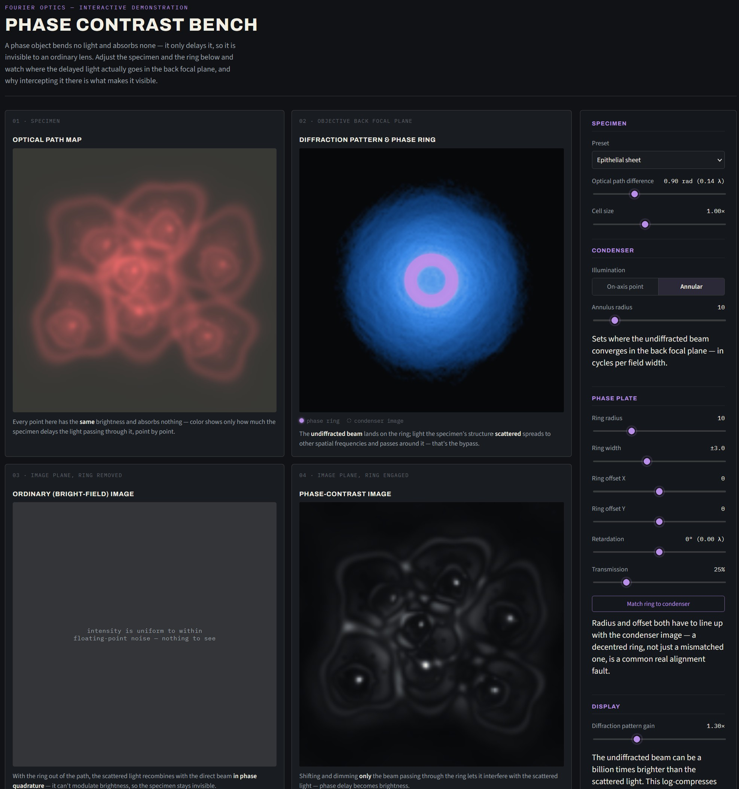

# Phase Contrast Bench

A self-contained, interactive simulation of a phase-contrast microscope. Everything — markup, styling, and a from-scratch 2D FFT — lives in the one file: `index.html`.

## Made with Claude

Made using Claude Sonnet 5

## Screenshot

## How to use it

Double-click `index.html`, or drag it into any modern browser (Chrome, Firefox, Safari, Edge). No install, no server, no build step.

It works fully offline. The only thing that needs an internet connection is the Archivo / Source Sans 3 / IBM Plex Mono typefaces, loaded from Google Fonts — without a connection the page just falls back to your system's default fonts, and everything else works exactly the same.

## Is it actually computing this?

Yes. There's no server, no pre-rendered images, and no lookup table. The page includes a hand-written radix-2 Cooley–Tukey FFT (about 30 lines of vanilla JavaScript), and every time you move a control it re-runs the real optics calculation on the spot:

1. Forward FFT of the specimen's phase (and, for mirror presets, amplitude) map.
2. For each illumination angle, shift that spectrum, apply whatever's sitting in the back focal plane — the phase ring's mask (radius, width, X/Y offset, retardation, transmission), a Foucault knife edge, or a Ronchi ruling — and inverse-FFT it.
3. Sum the resulting intensities across all angles and redraw the four panels.

That whole pipeline runs in roughly 50–100 ms, which is why it feels instant as you drag a slider. Nothing in the visuals — including the flat bright-field panel, the halo/shadow artifacts you get from detuning the ring, or the shadowgrams and Ronchigrams on the mirror presets — is scripted; it all falls out of the live math.

## The four panels

| # | Panel | What it shows |
|---|-------|----------------|
| 01 | Specimen | The phase object's optical path length map — a false-colour picture of a structure that's otherwise invisible |
| 02 | Objective back focal plane | The actual diffraction pattern, with the phase ring overlaid so you can see the undiffracted beam converge onto it while the specimen's diffracted spatial frequencies spread out around it |
| 03 | Bright-field image | The image with the ring removed — should render essentially flat, since a pure phase object can't modulate intensity without it |
| 04 | Phase-contrast image | The image with the ring engaged — the same phase structure, now visible as brightness |

## Telescope-mirror test mode

The specimen list also has a second group: **Perfect mirror (null test)**, **Spherical aberration**, **Turned-down edge**, **Zonal error**, **Astigmatism**, and **Coma**. These swap the phase-object map for a mirror's *wavefront error* — how far its surface departs from a true sphere — over a circular clear aperture. Picking one automatically switches to on-axis point illumination and to the **Knife edge** mask, because that's the setup a real test uses.

It's the same optics as the microscope side, just aimed at a different kind of invisible defect, and the Phase Plate group's **Mask type** selector makes that explicit:

- **Zernike ring** — the microscope's phase ring, unchanged.
- **Knife edge** — the classic Foucault test: block half the returning cone with a hard edge and sweep its **offset** through focus. A perfect mirror stays uniformly grey at every offset; a real defect throws a distinctive shadow (spherical aberration's shadow bends across the disc as you sweep, for instance).
- **Ronchi ruling** — pass the beam through a ruled grating instead, deliberately held off best focus with **Ruling defocus**. That's not optional: at exact focus every point of a perfect mirror converges to the same spot, so a ruling there could only flip the whole image on or off, never show bands. Racking it off focus spreads the converging cone out so different points on the mirror land on different ruling lines. A perfect mirror then shows straight, evenly-spaced bands; any figure error bows or curves them. **Ruling frequency** sets how many bars fit across the aperture.

Panel 04 relabels itself to **Foucault shadowgram** or **Ronchigram** to match, and panel 03 (ring/mask removed) shows the plain lit disc of the aperture — proof that, like a phase object, a wavefront error changes no ray's brightness, only its arrival time.

## Also worth trying

- Switch specimen presets — **Eukaryotic cell** and **Epithelial sheet** are built from an irregular, textured cell model (organic membrane wobble, nucleus, nucleolus, scattered organelles) rather than simple circles, so they read like real phase-contrast micrographs.
- Drag the phase ring's **radius** or **X/Y offset** away from the condenser annulus (Phase Plate group) and watch panel 04 lose contrast, or pick up an asymmetric shadow — the same fault a centring telescope corrects on a real microscope. **Match ring to condenser** snaps it back into alignment.
- Toggle **On-axis point** vs **Annular** illumination in the Condenser group to compare a simple central phase spot against the real Zernike annular design.
- Flip the **Retardation** slider negative to switch from positive to negative phase contrast.

## Layout

The four instrument panels sit on the left; the control console sits to their right as a single scrollable column. Under about 980px of window width it reflows to panels-on-top, controls-below (spreading back out into a row of groups) so it stays usable on a laptop or tablet; under ~520px it collapses to one column for phones.
